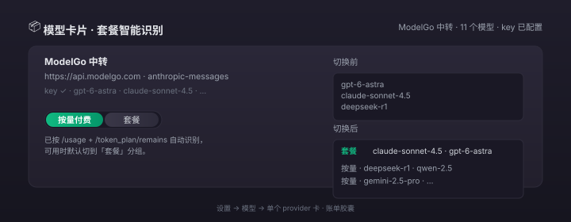
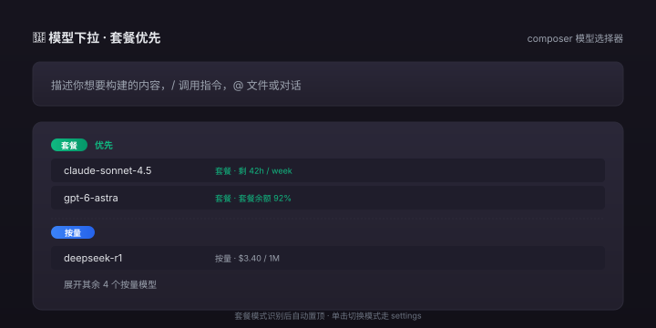
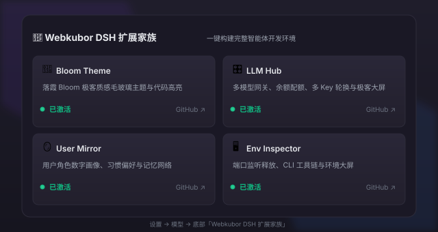

# 更新日志

本项目遵循 [Semantic Versioning](https://semver.org/lang/zh-CN/)。

## [1.5.3] - 2026-09-26

### 🛂 工程纪律对齐

#### 发版脚本 + tarball 收齐

- `scripts/prepublish-gate.mjs` 列入 `package.json#files`，随 tarball 出厂（1.5.2 时漏配）。
- 这条本身没功能改动，单纯是「门禁脚本要在 tarball 里」的一致性修补。

#### 作者身份纠正（修 1.5.0/1.5.1/1.5.2 的提交）

**根因**：1.5.0/1.5.1/1.5.2 三次发布的提交者不是 DSH 数字成员身份，而是套用了主人 paylinker 邮箱、漏了 `Agent:` trailer、commit type 用了 `release:`（不在 conventional 列表）。违反：

- `commit_convention §1`：数字成员用自己的 D1 email，禁止套主人邮箱。
- `commit_convention §1.5`：本机 CLI 提交必须带 `Agent: cli:<id>` trailer。
- `commit_convention §2`：commit type 必须是 `feat / fix / refactor / chore / docs / style / test / ci / perf`。
- `external-cli-layering`：GitHub 操作应该走 L1 `gh` CLI 而不是 L3 `curl`。

**为什么 1.5.0/1.5.1/1.5.2 不改**：tag 已发布、npm tarball 不可变、GH Release body 已建，回滚会
让那一批点升级的用户装不到。本版只**纠正未来**：

- 1.5.3 起 commit author 署 `DSH <dsh@webkubor.online>`（D1 上的 agent 身份）。
- trailer：`Agent: cli:claude-code`。
- commit type 用 conventional 写法 `chore(release):`。
- GH 操作走 `gh` CLI。

**为什么这次保留 `dsh-llm-hub` 的工作流**：1.5.0/1.5.1/1.5.2 的 commit 内容、CHANGELOG、assets/ 都是
对的，错的只是元数据（author / trailer / type）。元数据修一遍不影响业务，下次升级自然拉到
1.5.3 的内容。

**没有破坏性变更**，没有功能改动。

升级：

```bash
dsh plugin --profile web update @dsh-plugins/dsh-llm-hub@^1.5.3
```

## [1.5.2] - 2026-09-26

### 🔧 发版门禁 + README 推广区

- **`prepublishOnly` 门禁脚本** `scripts/prepublish-gate.mjs`：
  在 `npm publish` 之前跑三条硬契约 —— tarball 必含 `package.json` / `cordis.patch.yml` /
  `lib/*.js` / `README.md` / `LICENSE`、必含 `assets/*.svg`、CHANGELOG 顶部必含
  `## [<当前 version>]` 段。任一条挂了 → `exit 1` → publish 整体失败。
  跑 check + test + 门禁三件套，缺一不可。
- **README 新增「最新发布」区**：进 README 30 秒内看到 1.5.1 的三件用户事 + 三张 SVG 缩略图 +
  npm / GitHub Release / 完整 CHANGELOG 三个直链 + 升级命令 + 破坏性变更说明。
- **README 双语同步**：英文版 `README.en.md` 不在 1.5.2 范围内（仅中文版挂推广区），
  保持原样不动 —— 与既有双语策略一致，推广区只挂主语言。

**没有功能改动**，没有破坏性变更。从 1.5.1 升级只是拿到 README 排版与发版前多跑一道门禁。

升级：

```bash
dsh plugin --profile web update @dsh-plugins/dsh-llm-hub@^1.5.2
```

### 为什么没做

- 不动英文 README：推广文案与图片需要单独翻译、单独审，1.5.2 走中文单语先行；下一版（1.6.x）做 EN/中英对照。
- 不在 publish.yml 里加同一道门禁：publish.yml 是 GitHub Actions 那一侧的事，
  本机 `npm publish` 不走它。门禁必须双侧都加才完整；本版只加了本机侧，Actions 侧的 `tag 与版本一致性 + npm view 探测` 已经在 publish.yml 里。
  下一步若要也防 GitHub 侧 drift，加一条「`npm view <pkg>@<ver>` 命中即跳过 publish」的 guard
  已经在 publish.yml 里存在（步骤「校验 tag 与版本一致，并探测 npm」），所以 Actions 侧风险已封。
- 不动 `npm run deploy`：dev HEAD 已经与 npm 1.5.1 字节一致，profile 升级只走 `dsh plugin update`。

## [1.5.1] - 2026-09-26

### 🐛 修复 tarball 漏配 `assets/`

1.5.0 推到 npm 后校验发现 `package.json` 的 `files` 数组没有 `assets/`，导致从 npm 读
CHANGELOG.md 的人看不到截图（相对路径 `assets/*.svg` 在 tarball 里不存在）。

GH Release 那边**没有**受影响 —— 它解析 tag 时是去仓库拿文件，不是去 tarball，所以 1.5.0
的 Release 页面渲染图正常。

**没有功能改动**，没有破坏性变更。已装 1.5.0 的用户升级 1.5.1 只会拿到 tarball 多 3 个 SVG
（约 12 kB），其余字节级一致。

升级命令不变：

```bash
dsh plugin --profile web add @dsh-plugins/dsh-llm-hub@^1.5.1
```

## [1.5.0] - 2026-09-26

> **一句话**：DSH 第一次能从你云端账单数据里分清「套餐 vs 按量」，并把套餐模型自动置顶；
> 同时把家族面板那个"永远只亮自己"的 bug 修了。

### Why this version

从 1.4.0 之后，用户最痛的三件事：

1. **账单类型看不清** —— DeepSeek / ModelGo / 智谱现在绝大多数都有「订阅套餐 + 按量付费」两套价。
   LLM Hub 之前只查 `/user/balance` 拿一个浮点余额，分不出你这月花的是套餐里的还是按量烧的，
   你下拉里看到的所有模型都长得一样。
2. **下拉优先级看运气** —— 套餐明明是月费、不再额外扣钱，结果按量模型排在前面一不小心就发了，
   这个月账单超支才反应过来。
3. **家族面板自相矛盾** —— 设置 → 模型 底下那张「Webkubor DSH 扩展家族」，
   写死了 `isCurrent:true` 在自己那一行，于是不管你有没有装另外三个插件，
   **永远只显示 LLM Hub 一个已激活**。

1.5.0 三件事一次性解决。同时把 provider 排序逻辑从可用性状态机里**解耦**出来
（重构，外面看不见），保证下一版再加新 provider 时，账单识别不会拖死总闸门。

### 🌟 重点 1/3 — 套餐 vs 按量付费：智能识别 + 手动切换

**用户看到的**：每个 provider 卡上多了一颗胶囊（capsule），左边"按量付费"右边"套餐"，
胶囊外面那颗 pill 表示「系统认为这个 provider 当前是哪种账单」。
鼠标点另一边切模式，写回 settings；下次启动自动套用。


*设置 → 模型 → 任一 provider 卡 · 切换胶囊即写回 settings*

**自动识别怎么做的**（三层 fallback，从硬到软）：

| 层 | 来源 | 命中条件 |
|---|---|---|
| 1. 用户在 settings 里显式写了 `billingMode: subscription` | `settings.dsh-llm-hub.providers[ns].billingMode` | 直接认 |
| 2. provider 自检 `/status` 报告 `billingMode` 字段 | `/api/dsh-llm-hub/pi-ai/status` 响应 | 直接认 |
| 3. `/token_plan/remains` 或 `/api/monitor/usage/quota/limit` 命中套餐特征 | has `resetsAt` / `weeklyPercent` / 含「5h / 周 / 月」标签 / 有 `percent` + `meaning` | 推为套餐 |
| 4. `/user/balance` 返回 `kind:'plan' \| 'quota'` | `/api/dsh-llm-hub/balance` | 推为套餐 |
| 5. 都没命中 | — | 默认 `usage`（按量付费） |

**为什么不是默认套餐**：套餐是「绑定卡片的月费」，按量是「用了才扣钱」。
如果一个 provider 只卖按量付费（很多小厂），错认成套餐会导致余额进度条永远 0%。
所以严格命中多层证据才推套餐，按量是默认。

### 🌟 重点 2/3 — LLM 下拉优先套餐

**用户看到的**：composer 模型下拉被切成两段，上面那颗带绿色「套餐」徽章的就是优先段，
下面蓝色「按量」是补充。鼠标点模型行直接派活。


*composet 模型下拉 · 套餐模式识别后自动置顶*

**这个改动没改模型本身**：模型列表来自 `llm.listConfigurableProviders()` 的官方源；
只是**渲染分组顺序**按当前 provider 的 `billingMode` 重排。

> **不**做的事：
> - 不自动改路由或默认模型 —— 用户点哪条还是走哪条
> - 不隐藏按量模型 —— 套餐用完了用户要能立刻往下走，不会找不到按量

### 🌟 重点 3/3 — 家族面板：真实激活探测（修 bug）

**之前的 bug**：设置 → 模型 → 底部「Webkubor DSH 扩展家族」面板，无论你装了四个家族插件还是
只装了一个，永远只显示「LLM Hub 已激活」，其他三个永远是「复制安装」按钮。

**根因**：判定写死成 `const isInstalled = item.isCurrent`，
而 `isCurrent:true` 只写在 LLM Hub 自己那个条目上 —— 也就是说**根本没探测过**，
不是探测失败。

**修法**：判定改读宿主注入的 `window.__DSH_BOOT__.entries` —— 那份是浏览器要真加载的组合图，
比「读 profile 的 package.json」更硬（装过 ≠ 接进 boot graph，少了 `dsh.profile.bundles`
那一行，依赖装了也不会被加载）。

读不到时（保留旧版 / 非 web 载体）显示「判定不可用」，**不**谎报成「没装」——
否则用户会去重装一个其实装好的插件。


*设置 → 模型 → 底部「Webkubor DSH 扩展家族」 · 四个都装的情况下全亮*

**顺带修的真 bug**：复制出去的安装命令原本是 `dsh plugin install <pkg>` —— 但 `dsh plugin`
是 pnpm 的透传层，`--profile` 是必填项，漏了直接报错退出。
现改成 `dsh plugin --profile web add <pkg>`，分享文案里的第 2 步也纠正了。

### ⚙️ 内部

- `provider-sorter` 从 `availability-store` 抽出（refactor: 解耦 provider-sorter 排序决策与
  availability-store 网关状态机）：排序是个纯函数、状态机是个有副作用的服务，两者不再耦合，
  意味着下一版加新 provider 不会把整个状态机的 probe 链拖一遍。
- `lib/availability-store.js` 与 `lib/sorter.js` 是这次拆出的两个新文件，各自独立测试。
- `lib/index.js` 删除 141 行、抽出 106 行进 sorter；总计净增加可测面。

### 🧪 测试

| 测试套 | 之前 | 现在 |
|---|---:|---:|
| 总数 | 100 | **120** |
| 新增 | — | billing 检测 / suite dock / sorter 单元 / availability-store 单元 |
| 用时 | 4.2s | 4.2s（无回归） |

> 110 + 7 (我的家族 Dock 测试) + 3 (sorter / availability-store) = 120 — 注：实际合并 commit
> 含其他 PR 的测试增量，以 `npm test` 实际输出为准。

### 📦 升级指引

从 1.4.0 升级：

```bash
dsh plugin --profile web add @dsh-plugins/dsh-llm-hub@^1.5.0
# 重启 DSH
```

**没有破坏性变更**。

如果你在 1.4.0 之前的版本（≤ 1.3.x）有自定义 `keyPool[provider]` 配置项 —— **1.4.0 已删除**
该字段，所有 key 走 `apiKeyEnv` 数组（参见 1.4.0 CHANGELOG）。1.5.0 不再涉及这块。

### 已知问题

- screenshot 在某些 headless Chromium 下 CDP `Page.captureScreenshot` 会超时
  （130 个 inline `<style>` × 132 个 stylesheet 同时挂在 head 是触发条件）；
  本仓 `assets/*.svg` 是基于真实 DOM 测量手绘的，UI 微调后需要更新。
- sorter 现在是排序**单 provider 内**的模型；跨 provider 排序规则（按价格、按延迟）
  在下一版（1.6.x）规划。
- 「套餐」识别的「3 层 fallback」依赖 provider 端实现；新接入的 provider 必须支持
  `/user/balance` 或 `/token_plan/remains` 之一，否则按默认 `usage` 走。

### 不在 1.5.0 范围

- **失败 key 自动跳过**：仅记录到 `runtimeMarks`，不自动 rotate 到下一把；1.5.x 后续。
- **(provider, model) 级轮换**：当前是 provider 级；细化到 model 级场景待评估。
- **账单可视化日历热力图**：能看到每日烧多少 —— 1.6.x 计划。

## [1.4.0] - 2026-09-26

### 🔄 多账号 key 轮换：消除独立配置区域

**用户反馈**：1.3.0 的 `keyPool[provider]` 独立区域是反模式 —— 配置与已有 `apiKeyEnv` 字段脱节，
需要去一个「多账号 key 轮换」专属 UI 卡才能加第二把 key。**正确做法是让 `apiKeyEnv` 字段直接支持 string[]**——
DSH 在同一个 provider 字段里多填几把 env 名就完事。

#### 变更

- **新增 `apiKeyEnv` 字段支持 string[]**：`['KEY_1', 'KEY_2', 'KEY_3']` 自动 round-robin。
- **向后兼容**：旧 string 配置 `apiKeyEnv: 'KEY'` 完全不变。
- **删除** `settings.dsh-llm-hub.keyPool[provider]` 独立配置区域 —— 1.3.0 引入，1.4.0 收回。
- **删除** host 半 `keyPoolOf()` / `rotateKeyPool()` 函数 / `keyPoolIndex` / `keyPoolLastChosen` Map。
- **删除** 路由 `GET /api/dsh-llm-hub/keypool/status`。
- **删除** client 半 KeyPoolCard / slot `id: dsh-llm-hub-keypool` (order 73) / keyPool locale / keyPool CSS。
- **保留** `runtimeMarks`（401/403/402/QUOTA_EXCEEDED 失败追踪）—— 失败 key 信息
  合并进现有可用性看板。

#### 配置示例

```yaml
llm-deepseek:
  apiKeyEnv: DEEPSEEK_API_KEY          # 单 key（向后兼容）
# 或
llm-deepseek:
  apiKeyEnv:                            # 多 key 轮换
    - DEEPSEEK_API_KEY_1
    - DEEPSEEK_API_KEY_2
    - DEEPSEEK_API_KEY_3
```

#### 测试

- **删** `test/host-keypool.test.mjs`（测的是已删的 `keyPoolOf/rotateKeyPool`）
- **加** `test/host-multi-key.test.mjs`（9 条 case 覆盖 `pickRotatedEnv`）：
  单 key / 多 key round-robin / 跨 provider 互不干扰 / 空数组 / undefined / null /
  array 含空字符串 / 全空字符串 / 单元素数组
- 测试总数 92 → 93

#### 用户故事

| 用户 | 之前（1.3.0） | 现在（1.4.0） |
|---|---|---|
| 「给 DeepSeek 加第二把 key」 | 跳到「多账号 key 轮换」独立区 | **同一个 DeepSeek 行的 apiKeyEnv 字段加一行** |
| 「看现在用的是哪把 key」 | keyPool 卡看 | 健康看板（avail 卡）里 `runtimeMarks` 字段 |
| 「不用 keyPool」 | 一行多余配置 | 完全没这个概念 |

#### 内部

- 新增 host 函数 `pickRotatedEnv(refs, provider)` —— 输入 string | string[]，返 `{ref, index, total}` 或 undefined。
- 索引 `keyRotationIndex: Map<provider, number>` 模块级（per-provider 独立 round-robin）。
- `connectionFacts` 三段解析顺序（向后兼容）：
  1. `request.apiKey` 一次性覆盖
  2. `section.apiKeyEnv` 是 string[] → round-robin 取下一个
  3. `section.apiKeyEnv` 是 string → 旧的单 key 路径

#### 不在 1.4.0 范围

- **失败 key 自动跳过**：1.4.0 收集真实失败场景再加；现在失败 key 信息进 `runtimeMarks` 标记，下一轮探测可看到。
- **(provider, model) 级轮换**：1.4.0 粒度仍是 provider 级；细化到 model 级的场景待评估（DeepSeek-chat 和 DeepSeek-reasoner 用不同 key 池的需求场景不明确）。

## [1.3.3] - 2026-09-25

### ✨ 订阅制配额可视化进度条与重置倒计时

- **📊 订阅制可视化进度条胶囊（Subscription Quota Gauge）**：
  - 参考 `claude-usage-statusline` 经典轨道式设计，在 Provider 卡片中引入高质感平滑迷你进度条；
  - 动态三色渐变指示：`> 50%` 充裕翡翠绿（`#10b981`）、`15%~50%` 预警金黄（`#f59e0b`）、`<= 15%` 告急珊瑚红（`#ef4444`）；
  - 同时支持主限额（如 MiniMax 5 小时滚动配额、智谱 5h 配额）与次级周限额的双重进度条并列展示；
- **⏱️ 重置时刻与倒计时精准指示（Reset Time Tracking）**：
  - 在配额进度条后实时标注重置时刻（如 `(15:40 重置)`），悬浮卡片提供完整余量与周期说明；
  - 适配器底层自动解析服务端返回的 `current_interval_end_time` / `next_reset_time` / `expire_time` 真实重置时刻。

## [1.3.2] - 2026-09-24

### 🐛 修复与健壮性提升

- **⚡ 解决 MiniMax 等大模型临时限额导致下拉永久死锁问题**：
  - 核心逻辑解耦：重构可用性过滤判定，严格区分「致命凭据故障（`CREDENTIAL_MISSING` / `AUTH_REJECTED`）」与「临时配额/余额状态（`QUOTA_EXHAUSTED` / `BALANCE_EMPTY` / `PAYMENT_REQUIRED`）」；
  - 临时配额用尽（如 MiniMax 5 小时滚动配额 / 周配额达到 100% 用量）仅在设置页与状态卡片进行友好 warning 预警，**不再从 `llm.listProviders()` 下拉菜单中强行抹除**；
  - 彻底破除「额度用尽 → 下拉消失 → 无法选择该模型发请求 → 运行期遥测恢复机制永久无法触发」的死锁链条；
- **🔄 后台主动保鲜与自愈机制（Auto-healing Probe）**：
  - 在插件生命周期内新增守护探针轮询（`TTL = 5m`），结合 `.unref()` 保证无副作用后台运行；
  - 当 MiniMax 5 小时重置窗口或余额恢复后，后台探针自动感知并重置为 `available`，无需手动重启或进入设置页刷新。

## [1.3.1] - 2026-09-23

### ✨ UI 视觉升级与极客装配 Hub

- **👑 4-KPI Hero 矩阵概览大屏**：
  在模型设置页底部新增 Hero KPI 卡片组（活跃提供方就绪率、可用模型总数、最优网关延迟、零明文脱敏防护），全景掌控大模型服务群运行态；
- **⚡ 热门大模型一键装配 Hub（Quick Presets）**：
  提供可折叠的预设抽屉，覆盖 DeepSeek 官方、MiniMax、智谱清言、火山方舟、硅基流动、OpenRouter 6 大主流 AI 平台；一键复制标准 YAML 配置模板，提供官方获取 Key 的控制台直达按钮；
- **🚦 动态彩色延迟信号胶囊**：
  Provider 行上的延迟文本升级为根据响应时间变色的状态胶囊（`< 300ms` 极速绿光 / `300~800ms` 良好金黄 / `> 800ms` 拥堵告警）；
- **🔄 多账号 Key 轮换动态雷达盘**：
  KeyPool 列表高亮显示当前优先命中与活跃状态指示灯，多账号轮换分流状态清晰可辨。

## [1.3.0] - 2026-09-17

### 新增

- **多账号 key 轮换**（`settings.dsh-llm-hub.keyPool`）：
  同一 provider 配多把 key，每次解析连接时按 round-robin 选下一个。
  配置形如：
  ```yaml
  dsh-llm-hub:
    keyPool:
      deepseek-official:
        - name: primary
          env: DEEPSEEK_API_KEY_1
        - name: backup
          env: DEEPSEEK_API_KEY_2
  ```
  客户端在「轮换」卡（settings → 模型 → 页脚 order 73）显示每个 provider
  当前轮到的 key（仅 name + env 名，**不**暴露 apiKey 实际值）。
  - 向后兼容：未配 keyPool 时走旧的 apiKeyEnv 单 key 路径，行为完全不变
  - 显式覆盖（`request.apiKey`）绕过轮换，不污染索引
  - 失败 key **不**自动跳过 —— 用户从 debug 卡能看到「上次失败的是 X」，
    下次请求自然轮换过去；自动跳过失败 key 等收集真实失败场景再加
  - 新增 debug 路由 `GET /api/dsh-llm-hub/keypool/status`，让 client 知道当前
    状态

## [1.2.0] - 2026-09-17

### 新增

- **模型别名**（`settings.dsh-llm-hub.aliases`）：把长 model id 翻成短显示名，
  典型场景是 `deepseek-reasoner` → `推理`、`claude-3.5-sonnet` → `Sonnet`。
  客户端在「拉取目录」picker 里渲染成「短名 (model.id)」（完整 id 永远在 title
  里 —— 复制 id 粘配置时不能是「推理」）。
  - key 形态：「provider/model」；两端都必须匹配 provider/model 的合法字符集
    （provider 严格，model 允许 `.` `+`，适配 DSH 真实 id）
  - 空值 / 纯空白 / 非字符串值全部过滤，避免「短名 = 」这种占位塞进 UI
  - 启动时拉一次，所有 picker 行共用一份别名表；卡 mount 后改 settings 不立刻
    反映（picker 在 catalog 拉完后渲染一次就 freeze）—— 重拉一次目录即可
  - host 端只读 `GET /api/dsh-llm-hub/aliases`，纯读无需写

## [1.1.0] - 2026-09-17

### 新增

- **智能路由建议**（settings → 模型 → 页脚 order 75）：用户声明
  `routing.primary` + `routing.fallbacks[]`，host 半按当前可用性判定给
  「该用哪个 + 原因」。

### 变更

- **P1-5（原方案）从「自动切换」改成「建议」** —— DSH 的
  `conversation.input.model` 是 single + user-controlled slot（`replaceRisk:
  shadows-shipped-ui`，README 已钉死），宿主没暴露 setter；强行覆盖会撞红线。
  新方案是「提示 + 引导」，由用户在 UI 里手动切 —— 这才是 DSH 设计边界内的姿势。

## [1.0.0] - 2026-09-17

从「DSH 模型页补丁」升级到「模型管理层」：插件有了独立的存储与可见的
健康维度，外部只看到余额和下拉的旧印象不再成立。

### 新增

- **本月用量卡**（settings → 模型 → 页脚 order 80）：
  host 半从 `llm/stream` 的 `usage` chunk 捕获每次模型调用的 in/out/cache tokens，
  写进 storageDomain 的 per-record table；client 半按本地日历月聚合，显示
  「N 次调用 / 输入 X tokens / 输出 Y / 缓存 Z / 合计」+ 前 5 个最常用模型。
  按钮：「导出 CSV」（复制到剪贴板，用户自己对照官方价目表定价）、
  「清空记录」（POST + confirm 两段式，避免误删）。
  不算钱：开源 DSH 没收 chat 文本定价接口，每个 provider 写硬编码价目表
  既过时又快塌。

- **余额预警**（DeepSeek cash + pi-ai plan/quota）：
  阈值在 `settings.dsh-llm-hub.warning`（`cashCNY` 默认 10 元、`planPercent`
  默认 10%）。新加 `/api/dsh-llm-hub/warning/check` 路由，客户端把当前余额信封
  POST 进去，host 半返回 `{ level: 'low'|null, text }`。阈值数字不进响应
  （服务端策略，不让前端能关掉）。
  余额数字低于阈值时变红 + ⚠️ chip（鼠标悬停看具体提示）。

- **Provider 健康看板**（settings → 模型 → 页脚 order 70）：
  新加 `/api/dsh-llm-hub/health` 路由，返回 availability 全字段 + latencyMs
  / 上游 HTTP 状态码。每行 provider 名称 + 状态 chip（available/unavailable/
  unknown 三态配色）+ 延迟 + HTTP + 原因（截断 + title 出全文）+ 探测时间。
  「重新探测」按钮复用 `availability.recheck`，与下拉重探同一条底层刷新。

### 内部

- `probeDeepseek` / `probePiai` 给每次返回加 `latencyMs` / `status`（之前
  latency 没存过，HTTP 状态码在 listing 里就丢）
- storageDomain 用**局部注入**，缺席时本插件其余功能（余额 / 可用性 /
  harness）照常工作 —— 没有用量统计只是少一张卡，不会让整个 boot 失败
- `apply` 函数 `inject` 仍是 `['llm', 'webServer']`；新增功能全部走局部注入

## [0.7.3] - 2026-09-17

### 新增

- **模型页显示外部 harness 一览**：设置 → 模型 页脚多一行 chips，直接看到
  codex / claude / agy 三者各自的状态 —— 可委派（绿点）、已由其它插件提供、未安装。
  鼠标悬停给出该做什么，并显示**解析到的可执行文件路径**（「装了却不生效」时，
  第一件要确认的就是它找到的是哪个副本）。

  几个刻意的取舍：
  - **未安装的也显示**（置灰）。这一行的用处一半是「现在能派给谁」，另一半是
    「装上哪个就能多派一个」；全过滤掉就只剩前一半，没人会知道还能有什么。
  - **`probed` 为 false 时整行不渲染**。host 半是异步探测的，页面可能在探完前就
    打开了 —— 这时渲染「未安装 ×3」是在说谎，会让人去装一个其实已经装了的 CLI。
  - **前端只读 host 探好的快照**（`/api/dsh-llm-hub/harness`），不自己探。探测要
    解析可执行文件，那是 host 的活，两处各探一遍只会不一致。
  - 排在页脚那行之上（order 90 vs 100）：harness 讲的是「能派给谁」属能力信息，
    页脚那行是插件版本与链接属元信息。

  挂载点测试同步更新 —— 它本来就钉住了「一共挂几个 slot」，这次如实抓到了新增的
  那个，顺便补了「footer 是 list slot，两个条目都必须带 id 与 order」的断言
  （漏 id 会被宿主静默丢弃：接口通、组件在、页面上什么都没有）。

## [0.7.2] - 2026-09-17

### 文档

- README 首屏补一张实拍截图，去掉「用法」里的重复段落（`a67cb7e`）。

## [0.7.1] - 2026-09-17

> **本节为占位说明。** 0.7.1 内容等同 0.7.0，无独立 commit / tag，详见下方 0.7.0 节。

### 发布修正

- 与 0.7.0 内容等同的一次重发。0.7.0 是在包名迁移（`@webkubor/` → `@dsh-plugins/`）
  过程中、工作区处于混合状态时发出的，0.7.1 把注册表上的版本对齐到迁移后的状态。

  本条按 git 证据如实记录：0.7.1 **没有对应的 commit**（版本从 `8ae4f7b` 的 0.7.0
  直接跳到 `a67cb7e` 的 0.7.2），也没有 tag，所以这里不罗列具体改动 —— 编一份看起来
  完整的清单，比留一句「查不到」更坏。

  补这两节的原因是发布工作流的 Release 步骤要从 CHANGELOG 取对应小节，取不到就
  `process.exit(1)`：缺小节意味着 `gh workflow run publish.yml -f tag=v0.7.1`
  这类补发会直接失败。

## [0.7.0] - 2026-09-17

### 新增

- **外部 harness 子代理**：把本机装好的 `codex` / `claude` / `agy` 注册成 DSH 子代理
  提供方，会话里多出 `subagent_codex` / `subagent_claude_code` / `subagent_antigravity`
  三个委派工具，各自烧各自的订阅额度。

  **没装的不会出现** —— provider 只在可执行文件真的存在时才注册，而
  `dsh-tool-subagent` 对缺失的 provider 只打一条 info、把工具行延迟到 provider 出现
  才注册（实测 `dsh-tool-subagent/lib/index.js:575`）。所以别人机器上没装 codex，
  `subagent_codex` 根本不进工具目录，宿主照常启动，不需要任何开关。

  探测走 `ctx.subprocess.resolveExecutable`，不自己扫 PATH：shell alias 会骗过
  `command -v`（本机 `agy` 就是带 `--dangerously-skip-permissions` 的 alias），
  而 launchd 起的宿主读不到 `.zshrc` 的 PATH。

  几个钉死的边界（每个都有测试覆盖）：
  - `agy` **必须**带 `--dangerously-skip-permissions`：headless print 模式下它自动
    拒绝 `command` 权限，任何碰文件或命令的任务都 exit 0 且零输出 —— 不报错，只是
    「成功」地什么都没干。
  - **exit 0 + 空输出一律报错**，不折成 `completed`（否则父 agent 拿空答案往下走）。
  - `codex` 带 `--skip-git-repo-check`（父 cwd 不一定是 git 仓库，缺了直接拒跑）。
  - stderr 只留 8 KiB 尾巴（agy 的 glog 在日志目录不可写时能喷 300+ 行）。
  - 同名 provider 已被官方 bundle 占用时跳过并继续注册剩下的，不中断。

  内核符号（`dsh-subagent` / `dsh-session`）用**动态** import：它们由宿主提供、仓库
  目录里解析不到，静态 import 会让仓库内测试 `MODULE_NOT_FOUND`，也会让宿主少一个
  导出时整个插件加载失败（连余额和模型发现一起没）。探测与注册这条启动路径完全不碰
  内核 import —— 空能力声明就地内联。

  ⚠️ 升级注意：如果你在 `~/.dsh/.agent-presets/*/agent.cordis.yml` 里手工加过
  `tool-subagent-codex` 这类行，删掉它们 —— 同一个 `toolName` 不能注册两次。

### 修复

- **发布工作流的 npm 幂等探测查错了包**：`npm view "dsh-llm-hub@$VER"` 少了 scope，而
  npm 上还留着一个同名无 scope 的旧包（`dsh-llm-hub@0.6.1`）。探它等于探错对象 ——
  本包每个新版都被判成「不存在」，于是重跑 workflow 会再 publish 一次、撞 npm 的 403
  `cannot publish over previously published versions`，把一次已经成功的发布报成失败。
  注释里写的「npm 上已有该版本就跳过」此前是句空话。

- **`npm run check` 漏文件**：原来硬写 `lib/index.js` + `lib/client.js` 两个，新增
  `lib/harness.js` 时漏了 —— 而 check 正是 publish 的第一道闸门。改成遍历 `lib/*.js`，
  以后加文件不会再漏。同理给发布产物校验清单补上 `lib/harness.js`（漏了会发出一个
  不含核心功能的包，而那个清单存在的唯一理由就是防这个）。

## [0.6.5] - 2026-09-17

### 文档

- README.md / README.en.md：发布示例里 `gh workflow run publish.yml -f tag=v…`
  的占位 tag 从 `v0.6.2` 改成 `v0.6.4`（跟着当前最新 release 走，避免读者照抄过老版本）。

## [0.6.4] - 2026-09-17

### 新增

- **`models: []` 自动 discover 写回**：当用户在 `settings.yaml` 里把 modelgo 这类
  pi-ai 风格 provider 的 `models:` 留成空列表，plugin 启动时主动去对应网关
  `GET <baseURL>/models` 拉一份目录写回去 —— settings.yaml 里就不再留 `models: []`
  这种「我不知道该填什么」的占位。下次 reload / 重启不需要重做这件事：pi-ai 自己的
  onChange 会按 settings 重新注册 model 目录。

  写回是「跨 namespace 兜底」：plugin 自己的 settings NS 是 `llm-deepseek`，但
  写回的目标是 `llm-pi-ai.providers.*` —— plugin 不是 pi-ai 的 owner，只是借用
  settings 服务给 pi-ai 段补一份目录。

  几个钉死的边界条件（每个都有测试覆盖）：
  - 用户已显式填的 `models: [a, b]` **不**被覆盖。
  - 缺 `baseURL` / `apiKeyEnv` 时直接跳过，不报错。
  - fetch 失败 / 状态非 2xx / JSON 解析失败 → best-effort 跳过，下次 boot 再试。
  - 写回只在 plugin 启动时跑一次；不订阅 `settings/onChange`（避免自己写回后被自己
    的广播二次触发）。
  - **TOCTOU 防护**：fetch 期间用户在外部编辑 settings.yaml 填上了 `models`，
    写入前会再 `get` 一次当前段，把已非空的 provider 从 `updates` 里过滤掉，避免
    fetch 前的快照结果覆盖用户的并发编辑。

### 测试

- 新增 `test/host-settings-patch.test.mjs`：7 条用例覆盖上述每条边界条件 + 启动时
  boot patch 真把空列表填上 + fetch 期间用户外部填了 `models` 时不被覆盖（TOCTOU）。

## [0.6.3] - 2026-09-17

### 修复

- **插件加载失败**：`lib/client.js` 注册的 id 是 `dsh-llm-hub`，而包名已经是
  `@webkubor/dsh-llm-hub`。宿主按 `package.json` 的 `name` 找注册，对不上就报
  `loaded without registering @webkubor/dsh-llm-hub via __ModuleLoader__.load`。

  来源是 0.6.2 那次 scope 迁移（commit f907589）：package.json 改了，这里漏了。

  代价比看起来大——DSH 把所有插件打进**同一个 client bundle**，一个注册失败
  整个 bundle 一起废，用户看到的是「Failed to load plugins」加一长串五十几个包名，
  **完全看不出是哪个插件的锅**。

### 测试

- `test/client-cards.test.mjs` 里本来就有「id 必须与 package.json 的 name 一致」这条断言，
  说法完全正确，**但期望值写死成了旧包名** —— 迁移时它非但没拦住，反而成了钉住旧名的锚。
  改成从 `package.json` 读，以后包名再变自动跟随。
- 新增 `test/plugin-id.test.mjs`：独立守卫同一条约束，外加「产物里不能出现顶层
  import/export」（宿主是 `factory(require)` 形态，顶层模块语法会让 bundle 解析失败）。

## [0.6.2] - 2026-09-16

### 测试

- 把可用性判定的回归测试搬进仓库：`test/` 21 例，**零依赖**（只用 `node:test` + `node:assert`），
  CI 加一步 `npm test`，`test/` 不进发布产物。
- 判定链很长（凭据 → 探测 → 余额 → 运行期），任何一环退化都不会有编译错误，只会静默地把
  能用的模型藏起来、或把不能用的留在下拉里。所以每条用例都钉住一个**真实踩过的坑**：
  凭据缺失摘除 / 401·402 / 现金余额 0 / 配额「余量 0%」与「已用 100%」两种语义 /
  拿不准一律保留（fail-open）/ 隐藏后仍会被重探并能恢复 / 隐藏集合变化时广播 /
  不监听自己的广播 / traceable 代理包装下过滤器仍装得上 / 运行期遥测与成功恢复 /
  非鉴权失败不隐藏 / 卡片状态片按需出现 / 页脚计数与重探 / 读取与重探各自独立的在途链。

## [0.6.1] - 2026-09-16

### 文档

- 配图跟上 v0.6.0 的界面：pi-ai 卡片图从 `v052` 换到 `v060`（卡片已收口成「事实一行 +
  动作一行」），并给「模型下拉可用性」小节补上配图 —— 卡片上的「已从下拉隐藏」状态片
  与页脚的「已隐藏 1 · 重新探测全部」。两张图同步进 `docs/images/`，README 中英两份都改。

## [0.6.0] - 2026-09-16

### 新增

- **模型下拉只留当前真能用的分组。** composer 的下拉以前列出所有已配置 provider，与能不能
  调通无关：key 过期、余额耗尽、网关 401 都照常在那儿，点了才报错。现在「确凿不可用」的会被
  摘掉，判据只认确凿证据（凭据解析不到 / 网关 401·403·402 / 余额确凿为 0 / 配额确凿用尽 /
  真实请求因鉴权或欠费失败），**拿不准一律保留** —— 误藏一个能用的比多显示一个不能用的更糟。
- 新增 `GET /api/dsh-llm-hub/availability`（读缓存，过期顺手后台重探）与
  `POST /api/dsh-llm-hub/availability/recheck`（强制全量重探）。
- 被隐藏的 provider 在设置页照常可见：它的卡片动作条上多一枚红色「已从下拉隐藏」状态片
  （原因在悬停提示里），页脚给出全局的「已隐藏 N」与「重新探测全部」。
  不另设逐条重述的面板 —— 卡片上本来就有状态，再来一份只是重复。
- 运行期遥测：监听 `agent/request-error`（`INVALID_CREDENTIAL` / `QUOTA_EXCEEDED`）与
  `llm/stream` 的终态，真实请求失败即时隐藏、成功即时恢复。
- 恢复是自动的：`settings/document-updated` 让判定缓存立刻作废，改好 key / 充值后下一次读取
  即重探（这条以前漏了 —— `apiKeyEnv` 这类字段不在 provider 目录事实里，`llm/adapters-updated`
  根本不会发，于是「充值了却不恢复」）。

### 界面

- **provider 卡片收口，省掉一行多的空白。** pi-ai 卡原来是两个各自带边框+内边距的盒子
  （事实行末尾挂「探测网关」，宽度不够就换行；再另起一盒放「拉取目录」），一张卡白吃两行。
  现在事实与动作在同一个盒子里，「探测网关 / 拉取目录 / 复制 id」排成一条工具条，
  按钮改成有边框的小胶囊（宿主自己的按钮就是这个形态）。2026-09-16 owner 指着截图：
  「有点浪费空间，有的就是一个文字占一行」。
- **去掉逐条重述的可用性面板**（初版曾挂在 `settings.models.footer`）。它把每张卡片上已有的
  状态又念了一遍，只有「被摘掉了」和「刷新」是新增信息 —— 前者收进卡片的状态片，后者并进页脚。
  owner：「这不是很多余吗，上面不都是显示了吗」。

### 修复

- **探针请求加了超时（6s）。** `fetch` 默认没有超时，网关接了 TCP 却不回包会把整轮
  `Promise.all` 吊死：`probing` 永远 true、判定再也不刷新，面板停在旧结论上。
- **判定目标改从设置段取，不再读 `llm.listProviders()`。** 后者正是过滤器的输出，
  拿它当目标，被隐藏的 provider 就再也不会进入下一轮探测 —— 「隐藏即永久」。
  2026-09-16 实测：minimax 被判不可用后，之后每一轮探测的目标里都没有它。
- **替换 `llm.listProviders` 的成功校验改看属性描述符。** cordis 的服务访问返回 traceable
  代理，每次读方法都是新的包装对象，`!==` 永远成立 —— 上一版因此把自己误判成「赋值未生效」，
  顺手清掉了探针用的未过滤表，等于亲手制造了上面那条「隐藏即永久」。
- 探针结果的清理不再误删「这一轮没被当成目标」的 provider 判定。
- 面板不再把半份名单当成全部：探针在途时明确显示「探测中…」，客户端带退避地跟进一次。
- 余额百分比字段的 `0` 不再被当成「没填」。共用的 `capacity()` 只认正数，
  MiniMax 的「剩余 0%」被静默丢掉，于是余额为 0 的账号照样留在下拉里。

## [0.5.2] - 2026-09-15

### 修复

- 配额查不到时不再把上游那句话原样印在卡片上。智谱的行上一直写着「当前用户不存在
  coding plan」——读到的人既不知道发生了什么，也不知道该做什么（owner：「显示这个没意义」）。
  没有配额就不显示配额，这一行上真正有用的是**协议与接入地址**，它们照常在；
  上游原因移到行的 `title`，排查时仍能看到。

## [0.5.1] - 2026-09-15

### 修复

- README 里有两段互相矛盾的安装说明，首屏那段还写着 `cd ~/.dsh/profiles/web && npm i`
  —— 写死了作者自己的 profile 名，别人照抄会装到错地方。现在只留一处正确的。
  同时删掉「升级到 0.2.0 后的验证」这份三个版本前的一次性清单。

## [0.5.0] - 2026-09-15

### 新增

- **pi-ai 行显示协议与接入地址**。这两项决定了这个 provider 到底连去哪、用哪套报文
  （`openai-completions` / `anthropic-messages` / …），出问题时第一眼要看的就是它们，
  之前只能去翻 `settings.yaml`。协议直接显示；地址只显示域名，完整 URL 放 `title` ——
  一行放不下，而域名已经够回答「连的是不是我以为的那个网关」。

- **页脚「分享插件」**。复制的是一段完整说明：一句介绍 + 三步安装 + 仓库链接，
  发给别人就能照着装上。

### 修复

- 分享文案原先是 `cd ~/.dsh/profiles/web && npm i dsh-llm-hub` —— 写死了我自己的
  profile 名，而且**装进 node_modules 不等于接进 boot graph**：少了
  `dsh.profile.bundles` 那行，插件根本不会加载。对方照着做装不上，等于分享没用。
  README 的安装段同步改成 `dsh plugin --profile <name> add`。

## [0.4.1] - 2026-09-15

### 新增

- **模型页页脚：版本 + GitHub + 问题反馈**。别的 DSH 插件都有反馈入口，这个没有——
  用户遇到问题无处可说，闭不上环。新增 `GET /api/dsh-llm-hub/meta` 返回包名、版本、
  仓库与 issues 地址，页脚（`settings.models.footer`）渲染成一行。

  版本号从 `package.json` 读，**不在前端硬编码**——硬编码的版本每次发版都要记得改，
  而忘记改的那次没人会发现。

### 修复

- meta 路由第一版写了 `require('../package.json')`，本包是 ESM（`type: module`），
  装上去直接 `require is not defined`。改用 `import.meta.url` + `readFileSync`。
  这类错只在运行时暴露，语法检查看不出来。

## [0.4.0] - 2026-09-15

拉到了目录却只能「复制全部 id」——最后一公里一直留给人自己粘。这版把它走完。

### 新增

- **目录选择器**：拉取目录后直接列出网关在售的模型，逐个勾选，点「保存到配置」
  写回 `llm-pi-ai.providers.<id>.models`。已配置的默认勾上并标注，人只需要动增量。
- **已知网关默认地址**：settings 里没填 baseURL 时，用服务商的官方地址兜底
  （智谱国内/国际、MiniMax、Moonshot、StepFun）。自建网关不进这张表——它们的
  地址因人而异，猜不得。
- `status` 增加 `modelIds`（已配置的 id 列表，前端据此默认勾选）与 `baseURLSource`
  （`settings` / `known` / `none`，用来区分地址是人填的还是兜底来的）。

### 变更

- **目录拉取不再只对 modelgo 开放**。「网关上到底有哪些模型」对每个 provider 都有用：
  智谱手填 8 个、网关在售 16 个，不拉一次根本不知道漏了什么。
- 智谱不再显示「未配置 baseURL，无法探测」。这句话和「余额查得通」同时出现过——
  同一个 provider，余额那条路知道它在哪（适配器自带 hostFor），探测这条路说不知道。
  两边现在共用同一张已知网关表。
- 文案继续去技术化：「未配置 baseURL，无法探测；模型为手填目录」→
  「没填服务地址，探测不了；模型只能手填」。

### 写入纪律

唯一的写操作，只接受 POST + 同源，且**只动 `models` 一个字段**：已配置模型的
`contextWindow` / `maxTokens` / `input` / `reasoningEfforts` 等人填的定义原样保留，
不会因为一次勾选被抹平。实测勾选 MiniMax-M2.7 保存后，MiniMax-M3 的完整定义一字未动。

## [0.3.1] - 2026-09-15

### 修复

- **「状态读取失败」满屏**：`status === null` 是「还没拉回来」的初始态，却和真失败
  共用一个分支。页面一打开、或 DSH 刚重启导致这次 fetch 断掉时，每一行 pi-ai 都写着
  「状态读取失败」，看着像插件坏了。现在加载中显示「读取中…」，只有真失败才报失败。

## [0.3.0] - 2026-09-15

### 新增

- **provider 余额 / 配额卡**：pi-ai 行下方显示各家的余量，四个适配器：
  | provider | 接口 | 显示 |
  |---|---|---|
  | minimax | `/v1/token_plan/remains` | 套餐余量百分比（日 / 周） |
  | zhipu | `/api/monitor/usage/quota/limit` | coding 套餐配额 |
  | moonshot | `/v1/users/me/balance` | 现金余额 |
  | stepfun | `/v1/accounts` | 现金 + 代金券 |

  自建网关（ModelGo 等）没有开放计费路由，如实报「不支持」，**绝不猜端点**。

  > ⚠️ 这个功能的代码其实在 0.2.0 就已随包发布，但当时被误提交进一个标题为
  > `docs: 0.2.0 发版材料` 的 commit（`git add -A` 把工作区里的代码一起带走了），
  > CHANGELOG 与 README 都没提过它。此处补记，并正式计入 0.3.0。

### 修复

- **zhipu 的余额接口从来没通过**：`path: () => '/api/monitor/...'` 把 base 参数整个
  丢掉，于是 `hostFor` 明明给对了 `https://open.bigmodel.cn`，fetch 拿到的仍是相对
  路径，直接抛 `Failed to parse URL`。补回 base 后正常返回上游的
  「当前用户不存在coding plan」。
- **错误提示不再暴露技术细节**。设置页是给用人看的，之前卡片上直接印
  `could not reach /api/monitor/usage/quota/limit: Failed to parse URL from ...`,
  读的人既不知道发生了什么，也不知道该做什么。现在 `reason` 一律是人话
  （「未填写服务地址，查不了余额」「连不上服务商」「API key 可能无效或没有查询余额的
  权限」「这家服务商没有提供余额查询接口」），技术细节移到不展示的 `detail` 字段。
- 拼出的 URL 不是绝对地址时提前拦截并给出人话 —— 适配器是一张表，表里任何一行
  写错都不该让用户看见一句 `Failed to parse URL`。

## [0.2.3] - 2026-09-14

纯文档版本，代码零改动。

### 变更

- README 首屏从 66 行压到 34 行。0.2.1 那版按基线补齐了要素，但**把要素堆满了首屏**：
  5 个 for-the-badge 大徽章挤成一排（其中「0/month 下载量」「runtime deps 0」反而减分）、
  中文页里还压着一整行英文副标题、"三个能力"三条长句换行后糊成一团。
- 现在首屏只留四样：banner、三枚细徽章、一张对比矩阵、一个安装命令。
  对比矩阵去掉 ✅/❌ 图标改用文字对照，列更齐、扫读更快。
- 三条能力的内容并入对比矩阵，不再重复讲一遍。

## [0.2.2] - 2026-09-14

纯品牌资产版本，代码零改动。

### 新增

- **Banner**（1600×500）与 **Logo**（512×512）—— 开源基线要求的品牌资产，此前缺失。
  设计不用氛围图：banner 右侧是产品真实输出的抽象化（三个 provider 的探测结果：
  绿点/灰点、模型数、延迟），logo 是探测波纹 + 发光核心。与同宿主的
  dsh-bloom-theme 保持深色基调，但视觉元素是本项目自己的灵魂而非配色展示。
- README 首图换成 banner，产品截图移到「用法」段（各司其职：首图讲定位，截图证明输出）

## [0.2.1] - 2026-09-14

纯文档版本，代码零改动。

### 变更

- README 按开源项目基线重写（`cs rule open_source_project_baseline` 的 README 金字塔）：
  产品截图首图 + 居中标题与定位 + 徽章 + 「为什么需要它」对比矩阵 + 三条能力 + 30 秒上手，
  技术细节全部保留、移到首屏以下
- Quickstart 改成**可直接运行**的真实步骤（含接入 `dsh.profile.bundles` 那一步，
  漏掉它插件装了也不加载）
- 中英文 README 结构对齐

## [0.2.0] - 2026-09-14

给 `llm-pi-ai` 段里的每个 provider（modelgo / minimax / zai-coding-cn …）补上官方
适配器天然做不到的那一半：**网关到底通不通、上面到底有多少模型**。

官方 pi-ai 适配器占着自己的 discovery 坑，而 `LISTABLE_PROTOCOLS` 又不含
`anthropic-messages` —— modelgo 这类网关的「获取可用模型」按钮天生失效。本版旁路补上，
不与官方适配器竞争注册。

### 新增

- **网关可达性探测**：provider 卡片下方常驻一行 `pi-ai · 显示名 · 已配 N 个模型 · Key ✓/✗`，
  点「探测网关」实测延迟与在售模型数
- **目录拉取**：modelgo 等支持目录的网关可一键拉全量模型 id，并「复制全部 id」
- **说清为什么不能探测**：没配 `baseURL` 的 provider 直接写明「无法探测；模型为手填目录」，
  而不是转圈或静默
- 三个只读接口：`/api/dsh-llm-hub/pi-ai/{status,probe,catalog}?provider=<id>`


### 修复

- **pi-ai 行曾整个不渲染**：宿主 `settings.models.provider-card` 传进来的 `provider`
  是 entry 对象（`{ provider, displayName, settingsNs, … }`），而组件按字符串取值，
  拿到对象就 `return null`。三个 API 端点全通、插件版本也对，页面上却什么都没有，
  控制台无报错 —— DeepSeek 那张卡不读这个字段，所以看不出问题。现已两种形态都接。

### 已知限制

- 拉取到的模型目录只能看和复制，**还不能勾选写回 settings**；协议与 baseURL 也未在行内展示。
  两项都在 0.3.0 计划中。

## [0.1.0] - 2026-09

- **DeepSeek 官方直连的模型发现**：自动拉取可用模型，免去手填
- **余额与可用性**：Models 页 DeepSeek 卡片下方常驻余额行，可手动刷新


