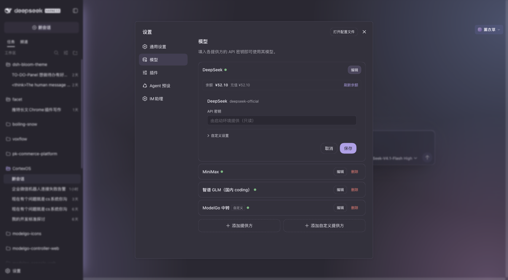

# dsh-llm-hub

**DSH 官方直连路由的 LLM 配置补强**：让 DeepSeek 官方直连（`deepseek-official`）也能
**自动发现模型**、并在 Models 页的 provider 卡片上**显示账户余额与可用性**。

零运行时依赖，**不修改 DSH 安装里的任何文件**。

> [English → README.en.md](README.en.md)

## 它补的是什么

DSH 自己已经具备全部机制，缺的只是"官方适配器没去用它们"：

| 能力 | 官方机制 | 官方直连的现状 |
|---|---|---|
| 模型发现 | `llm` 服务的 `registerModelDiscovery(ns, discover)` + Models 页「获取可用模型」 | `@deepseek-ai/dsh-llm-deepseek` **从未注册**（`0.1.2-rc.1` 与 `0.1.5-rc.2` 两版实测 `discover` 均零命中） |
| provider 卡片扩展 | `settings.models.provider-card`（按 `settingsNs` 做 key 分发） | 无注册者 → 该区域不渲染 |
| 账户余额 | DeepSeek `GET /user/balance` | 适配器不暴露 |

**发现注册表每个 settings 命名空间只允许一个注册**（第二次抛 `DUPLICATE_DISCOVERY`），
而 `llm-deepseek` 这个槽是空的 —— 本插件占上即可。官方 `slot-contract.d.ts` 也明确：
那两个扩展位就是给**本仓库之外分发的插件**用的。

## 安装

```sh
# 1) 部署进 web profile 的 node_modules
npm run deploy

# 2) 接进 boot graph（一次性）：在 ~/.dsh/profiles/web/package.json 里
#      dependencies        += "dsh-llm-hub": "file:<本仓库路径>"
#      dsh.profile.bundles += "dsh-llm-hub"
#    本包的 cordis.patch.yml 随 bundle 机制自动 insert，无需手写行。

# 3) 重启（改的是 boot graph，必须重启）
~/.dsh/restart.sh
```

## 用法

**模型发现**：设置 → 模型 → **DeepSeek（官方直连）** → **「获取可用模型」**。
点下去会实时 `GET https://api.deepseek.com/models`，列出官方在售模型供勾选加入。

**余额**：同一张 DeepSeek 卡片下方会出现余额行（挂载即查，可手动刷新）。



## 行为细节

### 连接事实

baseURL 与 apiKey 的解析顺序与适配器自身一致，且**每次调用惰性重读** `llm-deepseek`
设置段 —— 插件 apply 时该段可能尚未注册（启动竞态），而适配器本身也按请求重解析：

| | 解析顺序 |
|---|---|
| baseURL | `request.baseURL` → 设置段 `baseURL` → `$DEEPSEEK_BASE_URL` → `https://api.deepseek.com` |
| apiKey | `request.apiKey`（表单里现填的一次性 key）→ 设置段 `apiKeyEnv` 指定的凭据 → 该环境变量 |

### 余额路由

`GET /api/dsh-llm-hub/balance` → `{ ok, isAvailable, balances: [{ currency, total, granted, toppedUp }] }`

金额**原样保留 DeepSeek 返回的字符串**（上游是字符串，避免浮点误差）。
只接受 `GET`/`HEAD`（否则 405），并拒绝跨站读取（`Sec-Fetch-Site` 非 same-origin/none 时 403）
—— 余额属账户信息，即使服务绑在 loopback 也不该被跨站页面读走。

### 前端挂载点

`settings.models.provider-card`，`key = 'llm-deepseek'`。owner props 的
`keyConfigured` 决定是否发起查询：未配置密钥时显示提示而不请求。

## 已知限制

**发现候选承载不了 `inputModalities`。** llm 服务只保留
`id`/`name`/`contextWindow`/`maxTokens` 四个字段。所以通过按钮加入的 `deepseek-flash`
会落成**纯文本**条目，而它实际支持图像输入。加入后请手动补：

```yaml
llm-deepseek:
  models:
    - id: deepseek-flash
      inputModalities: [ text, image ]
```

这是 harness 发现契约本身的限制（官方 pi-ai 那条路同样如此），插件层无法修正。

## 开发

```sh
npm run check     # 两半语法
npm run deploy    # 同步到 web profile
```

- **host 半** `lib/index.js`：ESM（cordis loader 按 ESM 读）。
- **client 半** `lib/client.js`：**源码即产物**，classic script（无顶层 import/export），
  经 `window.__ModuleLoader__.load({ id, factory })` 注册。`id` **必须与 package.json 的
  `name` 完全一致**，否则 DSH 拒绝注册。React 由 `factory(require)` 提供，不打包进产物。
  当前体量无需构建步骤；若将来拆多文件，再加 esbuild（`format: 'iife'`，React 等标 external）。

## License

MIT
